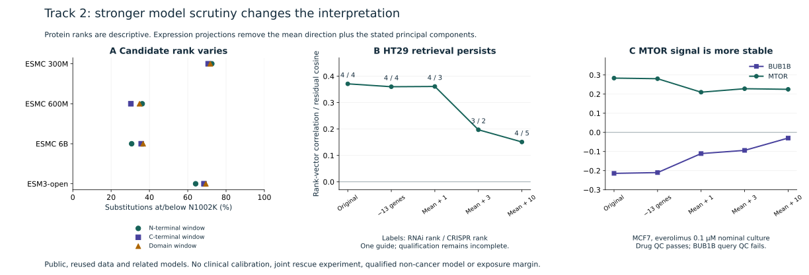

# Track 2: broader protein scores and expression-specificity tests

1 October 2026 · Session 67 · Feat-009 · Completed public-data research addendum

**The new tests strengthen HT29 as an assay-development lead and weaken reliance on
the MCF7 drug-reversal ranking. They do not establish a rescue drug.** Everolimus
remains an optional model-qualified mechanistic probe; HCQ stays reserve. Endogenous
allele function, trans phase, joint drug-plus-deficit response and clinical exposure
margins remain unresolved. No wet-lab experiment was performed.

All eight owner-host H100s ran new neural inference under
`/home/prachh/v/mva-track2-falsification-20261001-v27`. A second eight-GPU wave tested
expression specificity. Inputs were public references/resources and the already
reported candidate substitution. No subject reads, VCF records or clinical narrative
were transferred. Both waves finished; all owned GPUs were idle at the final check.
The remote folder is included in the **24 November 2026 deletion scope**.

## 1. A negative protein score needs a background

The [fixed scan plan](track2-saturation-plan-v27.json) covers ESMC 300M, 600M, 6B and
ESM3-open 1.4B, using the same checkpoints, public BUBR1 reference, six published
controls and three sequence windows as the earlier campaign. Each residue was masked
separately. The full 20-amino-acid distribution was retained, giving **9,472 masked
distributions and 179,968 non-reference substitution scores**. These reuse 19,950
distinct substitution identities across models/windows; they are not independent
experiments or an experimental deep mutational scan. This scan does not model
L737Ter, NMD, splicing or phase.

For each score, lower means less compatible with the model's sequence distribution.
The table reports the fraction of background scores **at or below** N1002K: a smaller
fraction places it toward the more incompatible end. These are descriptive ranks,
**not probabilities of pathogenicity, p-values or FDR**. Background substitutions have
no measured benign/pathogenic labels.

| Model | Negative scores, all substitutions | N1002K fraction at or below, all substitutions | N1002K fraction at or below, matched N→K |
| --- | ---: | ---: | ---: |
| ESMC 300M | 74.2–77.3% | 70.7–72.6% | 20.9–35.3% |
| ESMC 600M | 75.6–79.5% | 30.3–36.2% | 7.0–11.8% |
| ESMC 6B | 89.6–89.8% | 30.7–36.7% | 5.9–7.0% |
| ESM3-open | 71.6–72.9% | 64.1–69.4% | 16.3–35.3% |

Ranges span the original windows, not confidence intervals. There are 43 matched
N→K substitutions in each long window and 17 in the domain window, including N1002K.
The common-domain comparison and every control result are in the
[complete results](track2-saturation-results-v27.json); four linked TSV matrices retain
every masked distribution.

**Revision:** negative sign alone is weak support because it is common in the scanned
background. ESMC 600M/6B place N1002K relatively low among N→K substitutions, so the
favorable computational evidence is retained. Its rank depends on model and comparison
set. In ESMC 6B, K is the second-most compatible of the 19 alternatives at position
1002 in every window; 18/19 alternatives, including K itself, score at or below K.
This distinguishes positional constraint from a uniquely damaging lysine prediction.
It neither proves a benign allele nor identifies the functional defect.

All 12 original primary control orderings pass again. Expanding to the secondary
controls still breaks separation in **8/12** comparisons. All 84 earlier candidate/
control scores reproduce within **0.00003541** absolute difference. Do not turn the
small primary gate, model agreement or a rank into calibrated clinical accuracy.
Endogenous abundance, localization and chromosome-segregation assays remain the
discriminating next step; no folding-rescue drug is justified by this scan.

## 2. HT29 survives stronger specificity challenges

The [second fixed plan](track2-specificity-plan-v27.json) tests A375, A549, HT29, MCF7
and PC3 in both raw and PRIME RNAi representations against the same CRISPR data.
All five representations, all shared-gene retrieval panels and query neighbors are
retained: **918,999,010 expression comparisons**, not new experiments.

One sensitivity removes 13 measured cell-cycle/stress features from a declared list
of 20; seven are absent from the landmark assay. Another projects out the pooled
mean direction and 1, 3 or 10 principal components learned from other gene targets.
BUB1B, MTOR and eight related targets are excluded from fitting those directions.
Competing reference targets contribute to that fit; this is not a symmetrically
held-out retrieval benchmark.
These are **post-hoc sensitivity tests**, chosen after the earlier HT29 result was
known. Components can contain real checkpoint biology. Attenuation does not prove
confounding, and residual correlation is not a causal effect estimate.

| HT29 PRIME representation | BUB1B correlation | Rank among 3,665 RNAi targets | Rank among 5,113 CRISPR targets |
| --- | ---: | ---: | ---: |
| Original 978 features | 0.3712 | 4 | 4 |
| Remove 13 selected features | 0.3602 | 4 | 4 |
| Remove mean + 1 component | 0.3613 | 4 | 3 |
| Remove mean + 3 components | 0.1972 | 3 | 2 |
| Remove mean + 10 components | 0.1510 | 4 | 5 |

Absolute similarity falls under stronger projection, but relative retrieval remains
near the top. This strengthens HT29's limited assay-development role. A375 and A549
lose much of their agreement; MCF7 and PC3 remain weak or discordant. Both raw and
PRIME results are in the [complete specificity record](track2-specificity-results-v27.json).
Twenty unadjusted BUB1B/MTOR comparisons reproduce the v25 correlations and ranks.

**Revision:** retain HT29 as the leading public system for attribution checks. Require
an independent BUB1B perturbation and restoration, matched growth/viability and editing
controls, and first-division segregation plus daughter survival. The existing **one
guide**, failed-QC batch and tumour context still prevent model qualification for
non-cancer MVA rescue. Do not call HT29 an established disease model.

## 3. Separate MTOR engagement from BUB1B reversal

Only the previously adjudicated reference-matching everolimus identifier
`BRD-K13514097` is used. Dose, time, compound QC and query QC remain separate records.
At **0.1 µM nominal culture exposure** in MCF7:

| Representation | BUB1B correlation / reversal rank | MTOR correlation / mimic rank |
| --- | ---: | ---: |
| Original | −0.2144 / 7 | 0.2836 / 1 |
| Remove 13 selected features | −0.2103 / 8 | 0.2805 / 1 |
| Remove mean + 1 component | −0.1109 / 78 | 0.2100 / 1 |
| Remove mean + 3 components | −0.0941 / 125 | 0.2282 / 1 |
| Remove mean + 10 components | −0.0297 / 1,184 | 0.2250 / 1 |

Ranks use the same 4,274-gene reference. MTOR mimicry remains strong while BUB1B
reversal weakens. The drug profile passes the operational QC gate, but **zero BUB1B
query profiles pass QC**. In A375, the already tiny negative BUB1B correlation changes
sign in two sensitivities. HT29's reference-matching drug profile remains at 10 µM,
fails drug QC and correlates positively with BUB1B perturbation under all five views.

**Revision:** remove reliance on the original MCF7 rank-7 result as a robust rationale
for BUB1B rescue. Preserve it as an observed, adjustment-sensitive connection, alongside
the stable MTOR control. The v25 statement that signs survive its narrower adjustments
remains historical and scoped to those adjustments. Never combine HT29 qualification
and MCF7 drug data into a joint rescue result. New data measure neither clinical
exposure nor a therapeutic dose; clinical benefit and injury margins remain null.

The left panel uses each complete window background; smaller fractions mean lower
sequence compatibility. The other panels show correlation before projection and cosine
similarity of projected rank vectors afterward. None of these axes measures rescue.

## Computation, source review and reproduction

Anthropic's [optimization repository](https://github.com/anthropics/uplifting-biomolecular-modeling/tree/f4f62fa6592ae4938d49b1757bea0cfeff9f468e)
was reviewed at its pinned revision. Its ESMC kit uses different SDK/checkpoint pins
from our established comparison. We retained the qualified local upstream environment:
ESM 3.4.1.post1, Torch 2.11.0+cu126, float32, TF32 disabled, batch size eight and no
hosted inference. The optimization kit was **not executed**; no kit speedup or exact-mode
equivalence is claimed. Plan wording about BF16 refers to its documented example,
not a verified inability to run FP32. Pinned SDK/checkpoint continuity drove the choice.

The protein workers ran for 32.5–346.6 seconds after model-resource verification.
Timed CUDA forward work totals **1,004.196 seconds** across workers. One-second utilization records are in the
[compute audit](track2-falsification-compute-v27.json). All eight devices performed
neural inference with periods of high utilization; workers finished at different times.
This is not a claim that all eight remained saturated throughout the campaign.
The expression wave's matrix-product timing excludes covariance eigendecomposition,
CPU preprocessing and I/O. Counts measure work, not evidence strength.

Batch/single and repeat checks pass the fixed numerical tolerance. Expression CUDA/
CPU subset error is at most **3.78 × 10⁻⁷**. Reused source matrices and metadata were
hashed against v25 records, and the model checkpoints were checked against their prior
manifests. The **178-file** archive verifies locally; all 529 v26-bound inputs are
preserved. These are internal numerical checks, not independent scientific review.

The [source/search log](track2-falsification-sources-v27.json) records reading depth,
failed retrievals and limits. Primary LINCS work supports testing generic viability
signals; Cas9 work supports editing/selection controls. Neither establishes the cause
of a particular correlation here. Protein-likelihood bias literature motivates
calibration, not dismissal of all model evidence. Earlier efficacy, exposure, safety,
phase, provider and distribution gaps remain in force.

Reproduce from the new archive with
`scripts/archive_track2_falsification_v27.py verify` and
`scripts/analyze_track2_falsification_v27.py`; commands and source locations are in the
[reproduction note](track2-falsification-reproduction-v27.md). The public checker needs
no GPUs, subject files, credentials or network. Presentation v26 and earlier releases
remain frozen; this addendum must accompany them until a new presentation integrates it.
