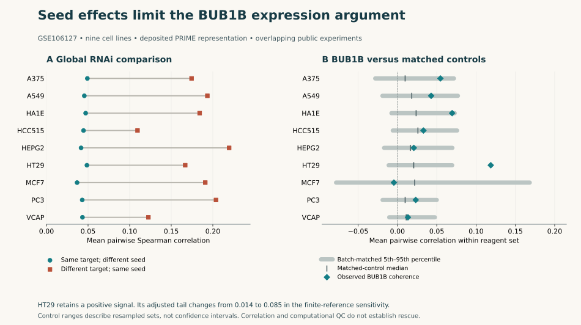

# Track 2: seed-aware falsification on eight H100s

27 September 2026. **The new analysis strengthens assay qualification, not the case
for treatment.** BUB1B RNAi has substantial seed-associated similarity; HT29 retains
a favorable signal, but its statistical interpretation depends on control coverage
and multiplicity. No rescue-priority drug is established. Everolimus remains an
optional model-qualified mechanistic probe; HCQ remains reserve.



## What was tested

The [fixed plan](track2-rnai-plan-v23.json) asks whether BUB1B expression coherence
survives two competing explanations: unrelated reagents sharing an annotated RNAi
seed, and unrelated reagents matched by experimental batch and replicate-ID count.
It also tests whether the same expression readout recovers agreement between RNAi
and CRISPR for other genes. These tests address on-target attribution, not drug rescue.

GSE106127 supplies 119,013 public signatures over 978 directly measured genes,
including 116,782 RNAi signatures and 55 BUB1B signatures across nine cell lines.
All 116,782 RNAi signature IDs **and underlying replicate-ID sets** overlap v19.
This is a new analysis of existing experiments, not independent biological replication.
Raw and deposited PRIME matrices were analyzed separately. PRIME uses the source
study's processing; it is not v19's locally fitted rank-space projection.
[Source review and reading limits](track2-rnai-sources-v23.md).

Eight owner-host H100s completed **1,536,619,950 unordered pair comparisons**,
**5,843,968 conditional control-set evaluations**, and **2,364,754 RNAi/CRISPR
reference comparisons**. The counts reuse signatures and genes; they are not sample
sizes. Complete comparisons, controls, missing results and failed thresholds are retained.
[Full result matrix](track2-rnai-results-v23.json).

## Results that change the next experiment

**Annotated seed independence is now checked.** The ten distinct BUB1B reagents
have different deposited 6-mer and 7-mer seeds. This closes the specific metadata
gap about shared annotated seeds within that reagent set. It does not measure actual
processed RNA products, potency, off-target transcripts or the selected allele pair.
The nine contexts have 3–10 BUB1B reagents; MCF7 has only three.

**Different-target seed controls cannot be omitted.** Across all nine cell lines,
same-seed/different-target pairs have higher mean correlation than
same-target/different-seed pairs, in both representations. For BUB1B specifically,
**45/54 evaluable reagent-context records** correlate more with unrelated same-seed
reagents than with BUB1B-targeting peers, separately in raw and PRIME. The denominator
excludes one HEPG2 reagent without a same-seed comparator. The reused observations,
uncontrolled potency and batch relationships prevent a causal claim that all BUB1B
signal is off-target.

**HT29 remains a favorable counterweight.** Its six-reagent PRIME mean pairwise
correlation is 0.1187. Against 100,000 batch/replicate-count matched sets, 236 equal
or exceed it: add-one tail 0.002370; the fixed 36-test BH adjustment gives 0.01422.
The raw representation is weaker (tail 0.05549; adjusted 0.21276). This is a
processed-expression clue for independent qualification, not a validated MVA model.
It does not replace the v19 five-provider-reagent sensitivity or its failed full filter.

**Small reference sets make the apparent statistical certainty fragile.** Most exact
seed references have only 4–40 possible sets; VCAP has 2,021,760. HEPG2 lacks a
required comparator in both representations and remains unknown. Four positive
seed-reference results have zero exceedances; an additional zero-tail MCF7 result
has negative coherence. Zero here is a count within a limited reference collection,
not zero probability of error.

The fixed analysis crosses its operational threshold in 5/36 comparisons. A labelled
[post-hoc finite-reference sensitivity](track2-rnai-tail-sensitivity-v23.json) applies
add-one to every finite reference set, retaining all 36 tests and missing results as
one. **None crosses 0.05 after that BH adjustment.** HT29's batch-adjusted value becomes
0.08532 because the other tail areas in the same family changed. A dependence-conservative
BY sensitivity also gives no crossing. Neither correction establishes exchangeability
or clinical calibration; these are operational reference-tail comparisons, not validated
FDR claims. The original results remain intact alongside this challenge.

| Result | Raw | PRIME |
|---|---:|---:|
| BUB1B records with stronger same-seed than same-target similarity | 45/54 | 45/54 |
| Intended gene ranked first in the orthogonal RNAi/CRISPR panel | 14/297 | 21/297 |
| Intended gene ranked within the top 5% of RNAi references | 84/297 | 93/297 |
| MTOR intended-gene rank across six paired cell lines | 1–479 | 1–13 |

The orthogonal panel supplies a useful counterweight to blanket dismissal of expression
analysis: some intended targets are recoverable. But most are not ranked first, the
panel was selected, targets/cell lines are dependent, and Cas9 derivatives differ from
parental lines. The equal-weight summaries do not reproduce the source study's weighted
consensus procedure. **BUB1B has no CRISPR profile in this panel.** MTOR agreement is
mechanism-reference evidence, not everolimus efficacy or normal-tissue benefit.

## Concrete revisions

The [qualification addendum](track2-rnai-validation-v23.md) now requires explicit seed
annotation and coverage records, unrelated same-seed controls, batch-aware allocation,
independent BUB1B perturbation/restoration and prespecified finite-reference handling.
It retains HT29 for independent investigation while requiring a relevant non-cancer
model for the rescue branch. A target-engagement result, expression reversal and
functional benefit remain separate observations.

The five new claim challenges are in the [v23 register](track2-rnai-register-v23.json).
They supplement the existing 27-claim v21 register. No phase, endogenous allele function,
exposure margin or wet-lab result is established. Drug-plus-deficit function, recovery,
chromosome/daughter-fate outcomes and injury remain the discriminating experiments.
Tumour killing remains separate from non-cancer rescue.

## Execution and reproducibility

Remote root: `/home/prachh/v/mva-track2-rnai-20260927-v23`. Only public NIH inputs,
code and plans were used. No subject transfer, hosted inference, new model provider or
neural-model training occurred. This work used CUDA statistics, not another structure model.
The existing uv environment was reused without syncing or changing it; its exact lock
was copied into the campaign. The five data files match NIH SHA512 entries; the sixth download is the checksum listing.

Workers took 19.0–53.5 seconds each, including CPU processing and I/O. CUDA events record
0.098–0.132 seconds per worker for the large correlation matrix products alone;
that excludes ranking, null lookups and other work. Peak tensor allocation was
1.48–3.10 GiB. One-second monitoring saw only 0–9% peak utilization. All eight devices
executed CUDA work, but the workload was **bursty, not sustained GPU saturation**.
Adding redundant jobs would not resolve the biological gaps.

Independent numerical implementations by the same agent checked all 18 retained
pair matrices for finiteness, all 5,843,968 retained null statistics/tails and selected
original GCTX coordinates with SciPy Spearman correlation. Maximum original-coordinate
error was below 5.27×10⁻⁸. This verifies arithmetic and provenance, not biology or an
independent scientific review. A unit test initially compared floating-point BH values
by exact equality; the test was corrected to a 10⁻¹⁵ tolerance. Production statistics
were unchanged. The figure was visually checked; its initial legend/footer overlap and
clipped control range were corrected.

The primary evidence archive has 161 files, 76,185,162 bytes, SHA256
`98809cd42b285cd1f5c88682738c758a6a210561e149ad76b2164eeddc92310e`.
Its 160 listed members are verified locally without extraction. The 24 omitted large
matrices remain hash-inventoried on the owner host. Local archive:
`results/feat009/rnai-v23/rnai-v23-audit.tar.gz`. Post-hoc sensitivity and narrative
files are bound separately by the public audit.

```bash
uv run --no-project python scripts/check_track2_rnai_v23.py
uv run --no-project python scripts/check_track2_harness.py
uv run --no-project python scripts/verify_track2_rnai_archive_v23.py results/feat009/rnai-v23/rnai-v23-audit.tar.gz --metadata results/feat009/rnai-v23/archive.json
```

Full reproduction stages the plan as `inputs/plan.json`, source scripts, the existing
pinned transcriptome `pyproject.toml`/`uv.lock`, and v19's public prepared signature
metadata as `inputs/v19-signatures.tsv.gz` in a **new** directory under `~/v`.
Run `uv sync --frozen`; change the two wrappers' fixed `TASK_ROOT` and set `ENV_ROOT`
to the new environment, recording those path-only changes. Launch the download wrapper,
then the analysis wrapper with `nohup` and separate logs. Run the numerical auditor
after all workers finish. Do not overwrite the archived campaign.

The v23 addendum is checked by the combined harness. V22 slides, report, narration,
workbook and recording ZIP remain frozen; the new addendum has not been inserted into
those historical exports. Existing provider/distribution, recording and submission
questions remain open. The remote campaign is on the November 24 deletion inventory.
