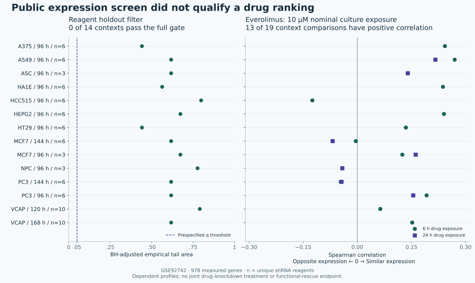

# Track 2: public expression data do not yet support a drug ranking

27 September 2026 · Research addendum v19 · Completed on all eight owner-host H100s

**The new analysis adds no evidence sufficient to promote a rescue drug.** Public
BUB1B knockdown signatures failed our primary reproducibility filter. Everolimus did
not consistently reverse their expression patterns, and the apparent lower-dose
coverage largely collapsed under chemical-identity and quality checks. These findings
strengthen the requirement to qualify the biological model before interpreting a drug
screen. They do not establish that everolimus helps or harms the child.

Everolimus remains an optional, model-qualified mechanistic probe; HCQ remains reserve.
No rescue-priority candidate, confirmed trans phase, clinical exposure margin or new
wet-lab result follows. The [v18 report](track2-report-v18.md) and presentation remain
frozen; this addendum supplements the [v15 validation plan](track2-validation-v15.md).

## What ran

We reanalysed public LINCS L1000 releases
[GSE92742](https://www.ncbi.nlm.nih.gov/geo/query/acc.cgi?acc=GSE92742) and
[GSE70138](https://www.ncbi.nlm.nih.gov/geo/query/acc.cgi?acc=GSE70138), using 978
directly measured genes. Inferred genes were excluded. The releases contain 312,438
compound-treatment profiles, including research compounds; this is not a count of
approved drugs or independent experiments.

Fourteen BUB1B consensus signatures cover eleven exact cell contexts. CUDA calculations
produced 12,185,082 query–compound comparisons across raw and sensitivity spaces, plus
560,000 random reagent-set resamples. The complete score vectors include exploratory
cross-cell comparisons; interpretation uses matching cell identifiers and keeps doses
and times separate. Genetic-reference comparisons, failed profiles and unfavourable
scores are retained. These rank correlations are not the provider's CMap tau scores.

The [primary plan](track2-transcriptome-plan-v19.json) and
[second-release plan](track2-transcriptome-phase2-plan-v19.json) were fixed before
opening their expression values, after metadata/QC inspection. The
[follow-up plan](track2-transcriptome-followup-plan-v19.json) is explicitly post-hoc.
All three waves completed on eight H100s. This was GPU statistical reanalysis, not new
neural-model inference. Kernels were brief and bursty; the run did not saturate the
GPUs. The [execution record](track2-transcriptome-reproduction-v19.md) gives the limits.

## Findings that change how we would screen

| Check | Observed result | Consequence |
|---|---|---|
| BUB1B reagent reproducibility | 0/14 contexts pass the full primary filter; adjusted empirical tails 0.442–0.799 | Do not interpret an expression rank as a qualified BUB1B drug hypothesis |
| Challenge to that negative result | 0/42 post-hoc arm/context comparisons pass the full filter; HT29 has a limited favourable exception below | Retain uncertainty about on-target reproducibility; do not declare the biology disproven |
| Primary everolimus signatures | 13/19 matched context comparisons have positive raw correlation at 10 µM nominal culture exposure | No consistent expression-reversal support; positive correlation is not proof of harm |
| Second-release chemical identity | 174/180 everolimus-labelled profiles have unresolved stereochemical metadata | Keep the three identifiers separate; no pooled everolimus dose curve |
| Exact-identity lower-dose subset | All six profiles at 0.1 µM fail the specified drug-quality filter | No replicated, qualified lower-dose reversal evidence |

**Reproducibility.** The operational filter required at least six unique shRNA
reagents, negative median BUB1B transcript z-score, positive median pairwise and
balanced-half agreement, and BH-adjusted empirical tail ≤0.05 across fourteen
contexts. Each context used 10,000 whole-reagent-set null draws with the same
median-over-splits statistic. ASC, HA1E and NPC also had positive median target
transcript scores. Transcript scores do not measure BUBR1 protein or checkpoint function.

The null does not match seed sequence, potency or off-target effects. Its tails and
BH adjustment are operational diagnostics, not calibrated probabilities of on-target
biology. Six reagents is a declared screening requirement, not an established biological
boundary. [RNAi seed effects](https://doi.org/10.1371/journal.pbio.2003213) and
[CMap reproducibility limits](https://doi.org/10.1038/s41598-021-97005-z) motivated these
checks; neither paper validates our exact filter.

**Evidence against over-rejecting the query.** The follow-up verified the provider's
exact consensus-member signature IDs and repeated resampling with those members and
shared-pattern removal. HT29's five-member projected result has split agreement 0.321
and adjusted tail 0.042. It misses the six-reagent requirement. The all-reagent HT29
projected result has adjusted tail 0.067. This is limited favourable evidence, not a
replacement for the primary result. Membership is now verified; independent seeds,
on-target potency and provider weighting remain unresolved.

**Everolimus.** Nineteen primary comparisons reuse fourteen distinct drug profiles
across knockdown times. All fourteen pass the specified drug QC, but their genetic
queries remain unqualified. NPC's weak raw negative correlation (−0.042) becomes
positive (+0.013) after shared-pattern removal; HCC515 likewise changes from −0.125
to +0.026. MCF7 and PC3 change with knockdown time. Removing shared or mitotic
patterns can also remove real biology, so a sign change is a sensitivity result.

The second release supplies three everolimus-labelled chemical identifiers.
Only BRD-K13514097 matches the reference stereochemical InChIKey in
[PubChem](https://pubchem.ncbi.nlm.nih.gov/compound/6442177) and
[NCATS](https://drugs.ncats.io/drug/everolimus). BRD-A25736793 leaves stereochemistry
unspecified (132 profiles); BRD-K13154216 supplies different stereochemical metadata
(42). This does not prove the vials contained a different compound. All six
reference-matching profiles—three A375 and three NPC, 0.1 µM, six hours—have one
sample, missing replicate-correlation metadata and low activity scores. Their mixed
correlations cannot establish a dose response. See the
[identity record](track2-transcriptome-identity-v19.json).

## Revised experimental requirements

1. **Qualify the perturbation before ranking drugs.** Establish endogenous BUBR1 and
   a relevant functional deficit in the chosen model. Require an independent genetic
   perturbation and an appropriate correction/rescue control. Confirm the selected
   allele model separately; generic knockdown cannot substitute for it.
2. **Measure the intervention that matters.** Test drug treatment in the qualified
   deficient model alongside matched controls. Drug-only and knockdown-only profiles
   are not that experiment. Pair expression with first-division segregation, daughter
   survival and sustained non-cancer function so cytostasis or selective cell death
   cannot masquerade as rescue. Keep tumour killing as a separate question.
3. **Verify material and exposure.** Resolve compound identity, concentration units,
   replication and target engagement before combining records. Neither 10 µM nor
   0.1 µM nominal culture concentration supplies a clinical dose or tissue margin.
4. **Retain a route to overturn this conclusion.** Independently reproducible,
   on-target signatures followed by replicated drug-plus-deficit functional benefit
   could justify reconsideration. A favourable transcriptomic rank alone cannot.

Opposing a compensatory expression response could be harmful, and useful functional
effects might occur without expression reversal. Expression and phenotype therefore
need paired measurement, as illustrated by
[Hafner et al.](https://doi.org/10.1038/s41467-017-01383-w). The present data settle
neither direction. HCQ does not gain priority because everolimus evidence is weak.

## Evidence and verification

Complete [primary](track2-transcriptome-results-v19.json),
[second-release](track2-transcriptome-phase2-results-v19.json) and
[post-hoc](track2-transcriptome-followup-results-v19.json) records accompany the
[source review](track2-transcriptome-source-review-v19.md). The archive retains all
78 BUB1B-to-compound score vectors, matched tables, null draws, metadata, plans,
code, lockfile and run logs. Large genetic-reference matrices remain on the owner host
with hashes. All 456 manifested archive files were verified locally.

A separate SciPy calculation from the original GCTX files checked all 139 raw
everolimus-labelled query/profile comparisons, including unresolved identifiers.
Maximum absolute difference from CUDA was 4.75×10⁻⁸. This verifies numerical agreement,
not biological validity; no independent scientist reviewed this addendum.

Only public NIH data and analysis code went to the owner host under `~/v`. No subject
files, clinical narrative, credentials or new hosted-model service were used. Existing
provider and historical-output licensing questions remain separate. Public LINCS
data are attributed to Broad/LINCS and the originating investigators; the analysis and
projections are our modifications under the provider's
[redistribution policy](https://clue.io/connectopedia/data_redistribution).
